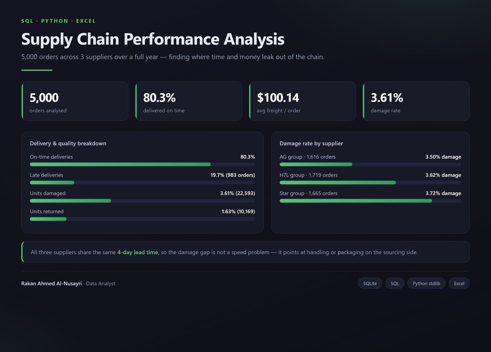

# Supply Chain Analysis

تحليل أداء سلسلة التوريد — 5,000 طلب عبر 3 موردين، لسنة كاملة.



**The question:** Where in the supply chain are we losing time and money —
late deliveries, damaged goods, or a specific supplier?

**What I did:**
- Cleaned and modelled 3 raw tables (order details, order status, suppliers)
- Loaded them into SQLite with a Python ETL script (`backend/etl.py`, standard
  library only — no installs)
- Wrote SQL to compute on-time rate, freight cost, damage rate, and return
  rate — overall and broken down by supplier

**What I found:**
| Metric | Value |
|---|---|
| Orders | 5,000 |
| On-time delivery | 80.3% (983 orders late) |
| Average freight cost | $100.14 / order |
| Damage rate | 3.61% of units shipped |
| Return rate | 1.63% of units shipped |

By supplier, damage rate ranges from **3.5% (AG group, best)** to **3.72%
(Star group, worst)** — a small but consistent gap across 1,600+ orders each,
worth investigating on the sourcing side. All three suppliers average the
same 4-day raw-material lead time, so the damage gap isn't a lead-time issue.

**Tools:** Python (stdlib `csv`/`sqlite3`), SQL, Excel (initial exploration)

## Run it yourself

```bash
python backend/etl.py
```

No dependencies — pure Python standard library.

## Files

```
data/            the 3 raw CSVs (order details, order status, suppliers)
backend/etl.py   loads the CSVs into SQLite and prints the KPIs above
```

---
Rakan Ahmed Al-Nusayri · [portfolio](https://github.com/RaKaN-DaTa) · rakanalnsyry8@gmail.com
